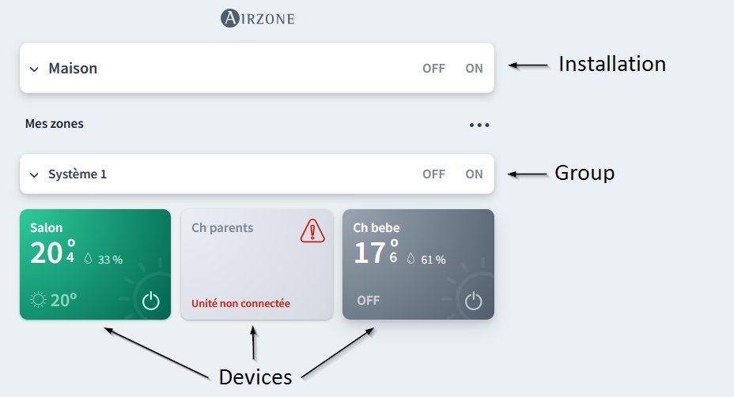

# Airzone Cloud

- [Airzone Cloud](#airzone-cloud)
  - [Presentation](#presentation)
    - [Abstract](#abstract)
    - [Module classes](#module-classes)
  - [Usage](#usage)
    - [Install](#install)
    - [Start API](#start-api)
    - [Get installations](#get-installations)
    - [Get installations](#get-installations-1)
    - [Get groups for each installation](#get-groups-for-each-installation)
    - [Get devices for each grou of each installation](#get-devices-for-each-grou-of-each-installation)
    - [Get all devices from all installations shortcut](#get-all-devices-from-all-installations-shortcut)
    - [Control a device](#control-a-device)
    - [HVAC mode](#hvac-mode)
      - [Available modes](#available-modes)
      - [List supported modes for each devices](#list-supported-modes-for-each-devices)
      - [Set HVAC mode on a master thermostat device (and all linked thermostats)](#set-hvac-mode-on-a-master-thermostat-device-and-all-linked-thermostats)
  - [API documentation](#api-documentation)
  - [Tests](#tests)
    - [Update configuration in config_test.json](#update-configuration-in-config_testjson)
    - [Run test script](#run-test-script)

## Presentation

### Abstract

Allow to communicate easily with Airzone Cloud to retrieve information or to send commands (on/off, temperature, HVAC mode, ...)

This library manage the main Airzone Cloud API (try to connect to [www.airzonecloud.com](https://www.airzonecloud.com) to be sure).

Official API documentation is available here : https://developers.airzonecloud.com/docs/web-api/

### Module classes

- **AirzoneCloud** : represent your AirzoneCloud account. Contains a list of your **installations** :
  - **Installation**: represent one of your installation (like your home, an office, ...). Contains a list of its **groups** :
    - **Group** : represent a group of **devices** in the installation
      - **Device** : represent your thermostat to control



## Usage

### Install

```bash
pip3 install AirzoneCloud
```

### Start API

```python
from AirzoneCloud import AirzoneCloud
api = AirzoneCloud("email@domain.com", "password")
```

### Get installations

```python
for installation in api.installations:
    print(
        "Installation(name={}, access_type={}, ws_ids=[{}], id={})".format(
            installation.name, installation.access_type, ", ".join(installation.ws_ids), installation.id
        )
    )
```

Output :

<pre>
Installation(name=Home, access_type=admin, ws_ids=[AA:BB:CC:DD:EE:FF], id=60f5cb990123456789abdcef)
</pre>

### Get installations

```python
for installation in api.installations:
    print(
        "Installation(name={}, access_type={}, ws_ids=[{}], id={})".format(
            installation.name, installation.access_type, ", ".join(installation.ws_ids), installation.id
        )
    )
```

Output :

<pre>
Installation(name=Home, access_type=admin, ws_ids=[AA:BB:CC:DD:EE:FF], id=60f5cb990123456789abdcef)
</pre>

### Get groups for each installation

```python
for installation in api.installations:
    print(installation)
    for group in installation.groups:
        print(
            "  Group(name={}, installation={}, id={})".format(
                group.name, group.installation.name, group.id
            )
        )
```

Output :

<pre>
Installation(name=Home)
  Group(name=System 1, installation=Home, id=60f5cb990123456789abdce0)
</pre>

### Get devices for each grou of each installation

```python
for installation in api.installations:
    print(installation)
    for group in installation.groups:
        print("  " + str(group))
        for device in group.devices:
            print(
                "    Device(name={}, is_connected={}, is_on={}, mode={}, current_temp={}, target_temp={}, id={}, ws_id={})".format(
                    device.name,
                    device.is_connected,
                    device.is_on,
                    device.mode,
                    device.current_temperature,
                    device.target_temperature,
                    device.id,
                    device.ws_id,
                )
            )
```

Output :

<pre>
Installation(name=Home)
  Group(name=System 1, installation=Home)
    Device(name=Salon, is_connected=True, is_on=True, mode=heating, current_temp=20.9, target_temp=20.0, id=60f5cb990123456789abdce1, ws_id=AA:BB:CC:DD:EE:FF)
    Device(name=Ch parents, is_connected=True, is_on=False, mode=heating, current_temp=17.2, target_temp=18.0, id=60f5cb990123456789abdce2, ws_id=AA:BB:CC:DD:EE:FF)
    Device(name=Ch bebe, is_connected=True, is_on=False, mode=heating, current_temp=18.6, target_temp=19.5, id=60f5cb990123456789abdce3, ws_id=AA:BB:CC:DD:EE:FF)
</pre>

### Get all devices from all installations shortcut

```python
for device in api.all_devices:
    print(
        "Device(name={}, is_on={}, mode={}, current_temp={}, target_temp={}, id={})".format(
            device.name,
            device.is_on,
            device.mode,
            device.current_temperature,
            device.target_temperature,
            device.id,
        )
    )
```

Output :

<pre>
Device(name=Salon, is_connected=True, is_on=True, mode=heating, current_temp=20.9, target_temp=20.0, id=60f5cb990123456789abdce1, ws_id=AA:BB:CC:DD:EE:FF)
Device(name=Ch parents, is_connected=True, is_on=False, mode=heating, current_temp=17.2, target_temp=18.0, id=60f5cb990123456789abdce2, ws_id=AA:BB:CC:DD:EE:FF)
Device(name=Ch bebe, is_connected=True, is_on=False, mode=heating, current_temp=18.6, target_temp=19.5, id=60f5cb990123456789abdce3, ws_id=AA:BB:CC:DD:EE:FF)
</pre>

### Control a device

All actions by default are waiting 1 second then refresh the device.
You can disable this behavior by adding auto_refresh=False.

```python
# get first device
device = api.all_devices[0]
print(device)

# start device & set temperature
device.turn_on(auto_refresh=False).set_temperature(22)
print(device)

# stopping device
device.turn_off()
print(device)
```

Output :

<pre>
Device(name=Salon, is_connected=True, is_on=False, mode=heating, current_temp=20.8, target_temp=20.0)
Device(name=Salon, is_connected=True, is_on=True, mode=heating, current_temp=20.8, target_temp=22.0)
Device(name=Salon, is_connected=True, is_on=False, mode=heating, current_temp=20.8, target_temp=22.0)
</pre>

### HVAC mode

#### Available modes

- **stop** : Stop mode
- **auto** : Automatic mode
- **cooling** : Cooling mode
- **heating** : Heating mode
- **ventilation** : Ventilation mode
- **dehumidify** : Dehumidifier / Dry mode
- **emergency-heating** : Emergency heat mode
- **air-heating** : Heat air mode (only compatible systems)
- **radiant-heating** : Heat radiant mode (only compatible systems)
- **combined-heating** : Heat combined mode (only compatible systems)
- **air-cooling** : Cooling air mode (only compatible systems)
- **radiant-cooling** : Cooling radiant mode (only compatible systems)
- **combined-cooling** : Cooling combined mode (only compatible systems)

Only master thermostat device can update the mode.

#### List supported modes for each devices

```python
for device in api.all_devices:
    print(
        "Device(name={}, mode={}, modes_availables={})".format(
            device.name,
            device.mode,
            device.modes_availables,
        )
    )
```

Output :

<pre>
Device(name=Salon, mode=heating, modes_availables=['cooling', 'heating', 'ventilation', 'dehumidify', 'stop'])
Device(name=Ch parents, mode=heating, modes_availables=[])
Device(name=Ch bebe, mode=heating, modes_availables=[])
</pre>

If modes_availables is an empty list, your device is not the master thermostat.

#### Set HVAC mode on a master thermostat device (and all linked thermostats)

```python
device = api.all_devices[0]
print(device)

# set mode to cooling
device.set_mode("cooling")
print(device)
```

Output :

<pre>
Device(name=Salon, is_connected=True, is_on=True, mode=heating, current_temp=20.8, target_temp=20.0)
Device(name=Salon, is_connected=True, is_on=True, mode=cooling, current_temp=20.8, target_temp=20.0)
</pre>

## API documentation

[API full doc](API.md)

## Tests

### Update configuration in config_test.json

- **email** : used to log-in to you AirzoneCloud account (default to *changeme@example.com*)
- **password** : used to log-in to you AirzoneCloud account (default to *changeme*)
- **log_level** : minimum level of log to display : DEBUG | INFO | WARNING | ERROR | CRITICIAL (default to *INFO*)
- **display_device_properties** : display all properties for each device (default to *true*).
- **display_api_token** : ask to display token used to connect to the AirzoneCloud API (default to *false*). Useful for https://developers.airzonecloud.com/docs/web-api/
- **refresh_before_display** : ask to call all refresh functions before displaying for test purpose (default to *false*).

### Run test script

```bash
./test.py
```